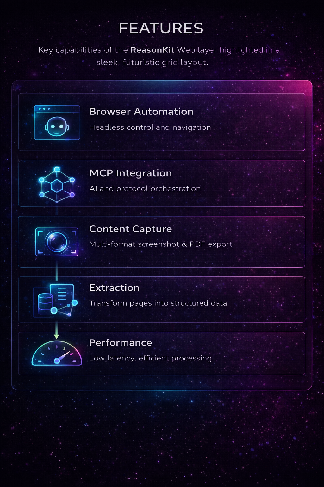
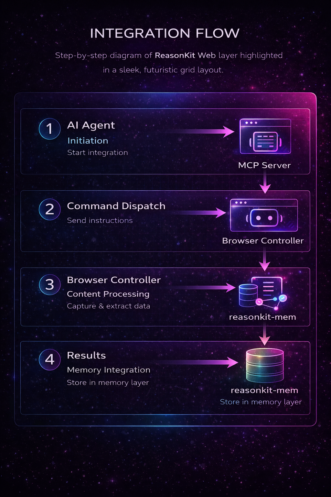

<div align="center">

# ReasonKit Web (Rust Edition)

**High-Performance Web Sensing & Browser Automation Layer**
**Rust-Native Implementation**

[](https://crates.io/crates/reasonkit-web)
[](https://docs.rs/reasonkit-web)
[](LICENSE)
[](https://www.rust-lang.org/)
[](https://modelcontextprotocol.io)

*The Eyes and Ears of AI Reasoning - Now Blazingly Fast*

[Documentation](https://docs.rs/reasonkit-web) | [Crates.io](https://crates.io/crates/reasonkit-web) | [ReasonKit Core](https://github.com/ReasonKit/reasonkit-core) | [Website](https://reasonkit.sh)

</div>

---

> **Note:** This is the **Rust implementation** of the ReasonKit Web Sensing layer. It supersedes the legacy Python prototype for performance-critical deployments.

Web sensing and browser automation layer for ReasonKit. Implements the Model Context Protocol (MCP) for seamless web interactions with AI reasoning systems, powered by Rust and ChromiumOxide.

## Features



## Quick Start

```bash
# Build the server
cargo build --release

# Run the MCP server
./target/release/reasonkit-web
```

## Architecture

The ReasonKit Web layer implements a high-performance web sensing architecture designed for AI reasoning systems:


### Key Design Principles

**Performance-First**: Built in Rust with async/await for maximum throughput
**Protocol-Driven**: Implements Model Context Protocol (MCP) for AI integration
**Modular Design**: Separates capture, extraction, and memory for flexibility
**Security-Focused**: Headless browser isolation and content sanitization

### Integration Flow



For detailed technical specifications, see [`docs/ARCHITECTURE.md`](docs/ARCHITECTURE.md).

</div>

## Technology Stack

| Component         | Technology    | Purpose               |
| ----------------- | ------------- | --------------------- |
| **Browser**       | ChromiumOxide | Async Rust CDP client |
| **MCP Server**    | mcp-sdk-rs    | AI agent integration  |
| **Runtime**       | Tokio         | Async runtime         |
| **Serialization** | Serde         | JSON handling         |

## License

Apache License 2.0 - see [LICENSE](LICENSE)

---

<div align="center">

**Part of the ReasonKit Ecosystem**

[ReasonKit Core](https://github.com/ReasonKit/reasonkit-core) • [ReasonKit Mem](https://github.com/ReasonKit/reasonkit-mem) • [Website](https://reasonkit.sh)

*"See How Your AI Thinks"*

</div>
